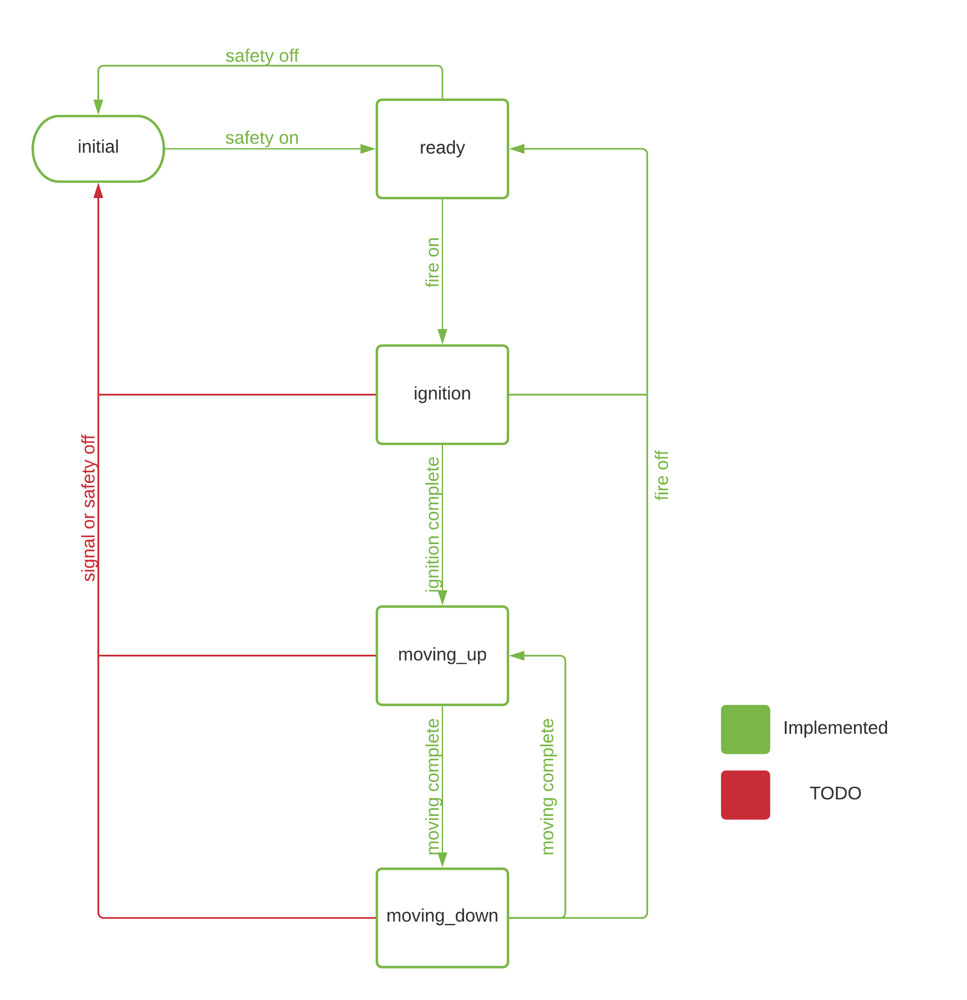

# Flamethrower
Source code of flamethrower firmware using Arduino Nano

It uses two PWM input to control:
1. Ignition
2. Power of the flame

For more details you can reference to the youtube channel:

https://www.youtube.com/channel/UCf2gzx_wVlQ8WtN4Uq27aKA

# Features
1. Support of safety switch. When safety swith is ON, firmare turn off the flame and ignition. Also it skips any input fire signals
2. Support for fire switch

# State Diagram

# Configuration Variables

## Input/output pins
1. PWM_PIN_SAFETY - safety pin number
2. PWM_PIN_INPUT - servo input for controlling flame power pin number
3. OUTPUT_SAFETY - safety highlight diods pin number
4. OUTPUT_PIN_IGNITION - ignition control pin number

## Flame and Ignition Variables
1. IGNITION_DELAY - how long ignition should be turned on (milliseconds)
2. IGNITION_SERVO_POSITION - position for the servo when ignition is in progress (degress)
3. FLAME_SERVO_START - start position of servo (usually same as IGNITION_SERVO_POSITION) (degrees)
4. FLAME_SERVO_END - end positions of servo (degrees)
5. FLAME_SERVO_UP_STEP - step of servo for increasing the flame (degrees)
6. FLAME_SERVO_DOWN_STEP - step of servo for decreasing the flame (degrees)
7. FLAME_SERVO_UP_DELAY - how fast to move servo to upper position (milliseconds)
8. FLAME_SERVO_DOWN_DELAY - how fast to move servo to lower position (milliseconds)

# TODO
1. Support of lost signal. When there is no signal for 5-10 seconds - turn safety ON, switch off flame
